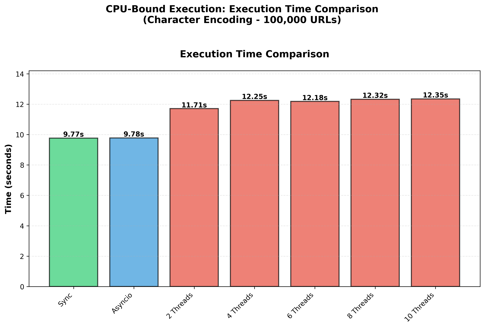
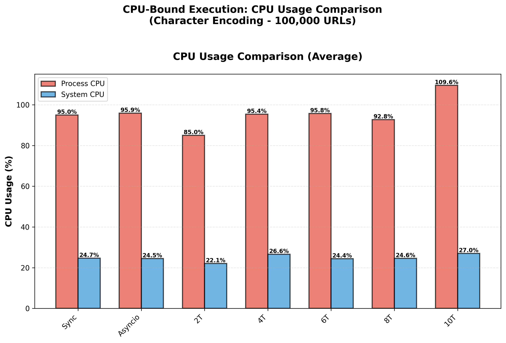
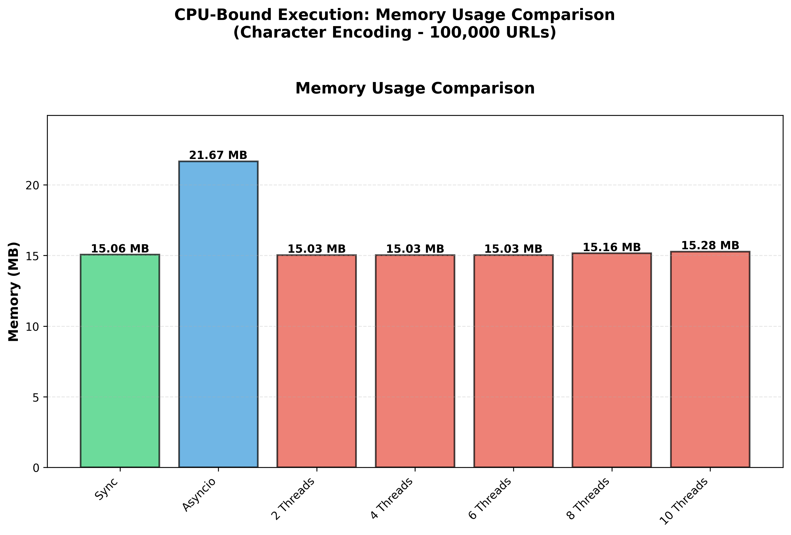
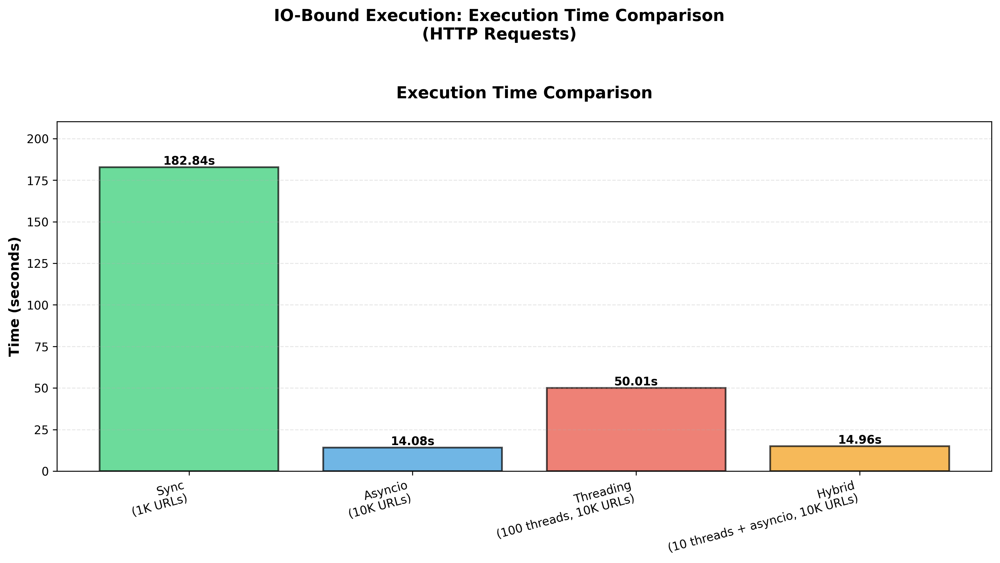
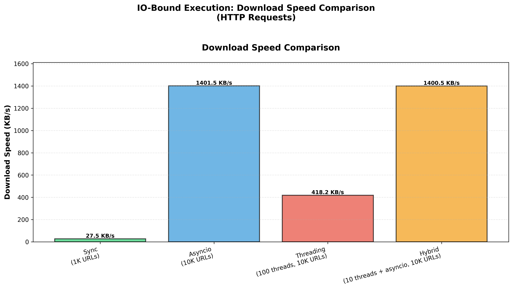
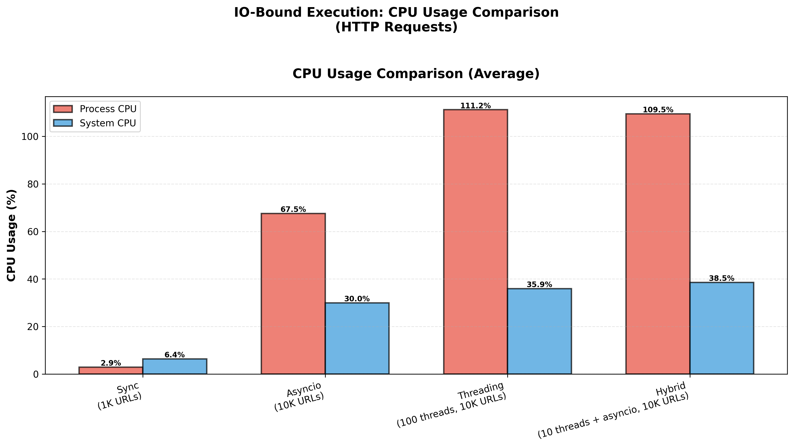
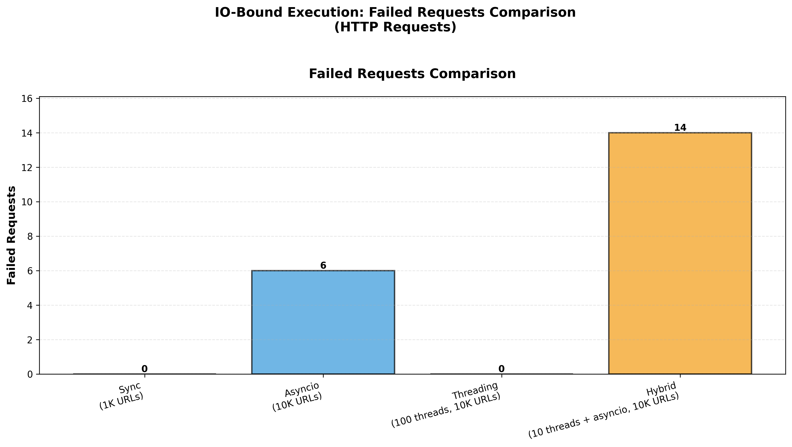

# 🧠 Python Concurrency Model Benchmark

A comprehensive benchmarking suite that empirically compares Python's concurrency models (sync, asyncio, threading, and hybrid approaches) across CPU-bound and IO-bound workloads.

This project provides real-world performance data with detailed metrics on execution time, CPU usage, memory consumption, and network throughput to help me (and hopefully you) make informed decisions about which concurrency model to use for specific use cases.

**Python version used**: 3.12

## 📌 WHY?

I wondered how Python's concurrency models perform and which one is best for IO-bound execution in practice. 
I already had answers to my doubts, but I wanted to help others understand the differences with practical results.

Mainly:
- I wanted to know which one, between asyncio and threads, performs well when executing IO-bound tasks
- I asked myself: can we combine asyncio and threads? What would be the result? Better, faster, or just worse?  
- I wanted to confirm whether there is any difference in terms of time and resource usage between threads, asyncio, and sync when performing CPU-bound execution
- Is the sentence "asyncio/threads should not be used with CPU-bound execution, they don't provide any advantage or even add overhead" correct?
- Clear my doubts!

So I conducted this benchmarking with multiple test runs to ensure consistency and reliability of the results.

We have two result sets:
- The first result set is about CPU-bound execution (character encoding) with sync, asyncio, and threads
- The second one is about IO-bound execution (HTTP requests) using sync, asyncio, threads, and asyncio + threads combined

**PS**: The insights and details in this doc are based on my understanding and experiment, any contribution are welcome (really, I will love it!)

## Quick recall

**CPU-bound execution**: Tasks that are limited by the speed of the CPU (like heavy calculations, data processing). The program spends most of its time using the processor rather than waiting for external resources like the network.

**IO-bound execution**: Tasks that are limited by input/output operations (like network requests). The program spends most of its time waiting for external resources rather than using the CPU.

[Read this for full understanding](https://medium.com/@romualdoluwatobi/cpu-bound-and-i-o-bound-execution-explained-for-developers-with-real-life-examples-1b4a6abb2b42)

**Understanding CPU Metrics:**
When reading the results, you'll encounter two types of CPU usage measurements:
- **System CPU (sys)**: The total CPU usage across all applications and processes running on the entire system. This shows the overall system load.
- **Process CPU (proc)**: The CPU usage specifically consumed by the benchmark script/process being tested. This is what matters most for comparing concurrency models.

For example, if you see "Process CPU: 95%" and "System CPU: 25%" on a 4-core system, it means the benchmark process is using approximately one full CPU core (95% of one core), while the entire system is using 25% of its total capacity (1 out of 4 cores).

## Experiments

### CPU-Bound Task: Character Encoding
This experiment evaluates how different concurrency models handle CPU-intensive operations by counting the byte size of each character in 100,000 generated URLs. The task involves iterating through each character in every URL and encoding it to calculate its byte representation—a purely computational workload.

The synchronous version of the script can be found [here (synchronous version)](./cpu-bound/sync.py). Other implementations are available in the same directory: [asyncio.py](./cpu-bound/asyncio.py) and [thread.py](./cpu-bound/thread.py).

#### Synchronous Execution Results

| Metric | Value | Unit |
|--------|-------|------|
| **Execution Time** | 9.77 | seconds |
| **Total Bytes Processed** | 51,258,766 | bytes |
| **CPU Usage (Process)** | 95.01% (avg) / 104.2% (max) | % |
| **CPU Usage (System)** | 24.67% (avg) / 28.5% (max) | % |
| **Memory Usage** | 15.79 | MB |
| **CPU Cores** | 4 | cores |

**Key Observations:**
- The process utilized nearly 100% of a single CPU core on average (95.01%), with peaks at 104.2%
- System-wide CPU usage remained low (24.67% average), indicating single-core execution
- Memory usage was constant at 15.79 MB throughout execution
- Completed processing 100,000 URLs in approximately 9.77 seconds

#### Asyncio Execution Results

| Metric | Value | Unit |
|--------|-------|------|
| **Execution Time** | 9.78 | seconds |
| **Total Bytes Processed** | 51,258,766 | bytes |
| **CPU Usage (Process)** | 95.89% (avg) / 102.6% (max) | % |
| **CPU Usage (System)** | 24.47% (avg) / 26.8% (max) | % |
| **Memory Usage** | 22.72 | MB |
| **CPU Cores** | 4 | cores |

**Key Observations:**
- Similar to sync execution, the process utilized nearly 100% of a single CPU core (95.89% average)
- System-wide CPU usage remained low (24.47% average), confirming single-core execution
- Memory usage was constant at 22.72 MB (44% higher than sync due to asyncio event loop overhead)
- Execution time (9.78 seconds) is virtually identical to synchronous execution
- **Asyncio provides no performance advantage for CPU-bound tasks** and adds memory overhead

#### Threading Execution Results (10 Threads)

| Metric | Value | Unit |
|--------|-------|------|
| **Execution Time** | 12.35 | seconds |
| **Total Bytes Processed** | 51,145,360 | bytes |
| **CPU Usage (Process)** | 109.59% (avg) / 172.1% (max) | % |
| **CPU Usage (System)** | 27.03% (avg) / 27.9% (max) | % |
| **Memory Usage** | 16.01 | MB |
| **CPU Cores** | 4 | cores |
| **Thread Count** | 10 | threads |

**Key Observations:**
- Process CPU usage averaged 109.59%, indicating utilization of ~1.1 CPU cores across 10 threads
- System-wide CPU usage (27.03% average) remained similar to sync/asyncio approaches
- Memory usage (16.01 MB) was comparable to sync execution, lower than asyncio
- **Execution time was 26% slower** (12.35s vs 9.77s) than sync/asyncio due to thread context switching overhead
- **Threading provides no benefit for CPU-bound tasks** and actually degrades performance due to GIL contention and context switching

#### Visual Performance Analysis

The following plots provide a comprehensive visual comparison of the CPU-bound execution performance:

**Execution Time Comparison:**



This plot clearly shows that synchronous and asyncio approaches have nearly identical execution times (~9.77s), while threading with 10 threads is noticeably slower (12.35s).

**CPU Usage Comparison:**



The CPU usage analysis reveals that all approaches utilize approximately one CPU core (process CPU ~95-110%), with system-wide CPU usage remaining low (~24-27%). For threads, this confirms that Python's GIL prevents true parallel execution for CPU-bound tasks.

**Memory Usage Comparison:**



Memory consumption is relatively consistent across all approaches, with asyncio showing the highest usage (22.72 MB), probably due to event loop overhead, while sync and threading remain similar (~15-16 MB).

**My Take:** For CPU-bound tasks, use synchronous execution or multiprocessing. Asyncio adds memory overhead without performance benefits, and threading actively degrades performance as the thread count increases.

---

### IO-Bound Task: HTTP Requests
This experiment evaluates how different concurrency models handle IO-intensive operations by making HTTP requests to a test server and storing the response data. The task involves fetching data from thousands of URLs—a workload where the program spends most of its time waiting for network responses rather than performing computations.

**Workload Details:**
- **Task Type**: IO-bound (HTTP GET requests with network latency)
- **Operation**: For each URL, make an HTTP GET request, receive the response, and write the content to a file
- **Test Server**: AWS EC2 instance running HTTPBin behind a Network Load Balancer (NLB)
- **Concurrency Models Tested**:
  - **Sync**: Traditional sequential execution with requests library
  - **Asyncio**: Async/await pattern with aiohttp (concurrent requests)
  - **Threading**: Multi-threaded execution with thread pools (10, 100, 1000 threads)
  - **Hybrid (Threads + Asyncio)**: Combination of threading and asyncio event loops

**Purpose**: This experiment answers which concurrency model is most efficient for IO-bound tasks, where the bottleneck is waiting for external resources (network) rather than CPU computation.

The synchronous version of the script can be found [here (synchronous version)](./io-bound/sync.py). Other implementations are available in the same directory: [asyncio.py](./io-bound/asyncio.py), [thread.py](./io-bound/thread.py), and [thread_plus_asyncio.py](./io-bound/thread_plus_asyncio.py).

#### Synchronous Execution Results

**Test Configuration: 100 URLs**

| Metric | Value | Unit |
|--------|-------|------|
| **Execution Time** | 18.16 | seconds |
| **Total Downloaded** | 537,368 | bytes |
| **Download Speed** | 29.58 | KB/s |
| **Total Uploaded** | 146,011 | bytes |
| **Upload Speed** | 8.04 | KB/s |
| **Data Written to File** | 143,002 | bytes |
| **Failed Requests** | 0 | requests |
| **CPU Usage (Process)** | 2.91% (avg) / 6.0% (max) | % |
| **CPU Usage (System)** | 7.70% (avg) / 34.7% (max) | % |
| **Memory Usage** | 30.36 | MB |

**Key Observations:**
- Very low CPU utilization (process avg: 2.91%), confirming the workload is IO-bound
- System CPU spikes (up to 34.7%) indicate network/system activity rather than computation
- Consistent memory usage at ~30.36 MB throughout execution
- Sequential processing: 100 URLs completed in 18.16 seconds (~180ms per request)
- Perfect reliability: 0 failed requests

**Test Configuration: 1,000 URLs**

| Metric | Value | Unit |
|--------|-------|------|
| **Execution Time** | 182.84 | seconds |
| **Total Downloaded** | 5,146,743 | bytes |
| **Download Speed** | 28.15 | KB/s |
| **Total Uploaded** | 1,502,356 | bytes |
| **Upload Speed** | 8.22 | KB/s |
| **Data Written to File** | 1,445,934 | bytes |
| **Failed Requests** | 0 | requests |
| **CPU Usage (Process)** | 2.94% (avg) / 7.9% (max) | % |
| **CPU Usage (System)** | 6.38% (avg) / 61.0% (max) | % |
| **Memory Usage** | 30.45 | MB |

**Key Observations:**
- Execution time scales linearly: 10x URLs = ~10x time (18.16s → 182.84s)
- CPU utilization remains very low (process avg: 2.94%), confirming IO-bound nature
- Higher system CPU spikes (up to 61.0%)
- Memory usage remains stable at ~30.45 MB (minimal increase from 100 URLs)
- Consistent download speed (~28-29 KB/s) across both tests
- Perfect reliability maintained: 0 failed requests across 1,000 URLs
- **Synchronous execution is inefficient for IO-bound tasks** - the program waits idle for each network response

#### Asyncio Execution Results

**Test Configuration: 10,000 URLs**

| Metric | Value | Unit |
|--------|-------|------|
| **Execution Time** | 14.08 | seconds |
| **Total Downloaded** | 20,201,259 | bytes |
| **Download Speed** | 1,435.17 | KB/s |
| **Total Uploaded** | 11,514,625 | bytes |
| **Upload Speed** | 818.04 | KB/s |
| **Data Written to File** | 14,187,346 | bytes |
| **Failed Requests** | 6 | requests |
| **CPU Usage (Process)** | 67.53% (avg) / 102.5% (max) | % |
| **CPU Usage (System)** | 29.96% (avg) / 86.6% (max) | % |
| **Memory Usage** | 120.26 MB (avg) / 130.68 MB (max) | MB |
| **CPU Cores** | 4 | cores |

**Key Observations:**
- **Dramatic performance improvement**: 10,000 URLs in 14.08 seconds vs sync's 182.84 seconds for 1,000 URLs (≈129.9x faster overall)
- **50x faster throughput**: Download speed jumped from 28 KB/s (sync) to 1,435 KB/s (asyncio)
- Higher CPU utilization (67.53% avg) shows the program is actively processing concurrent requests
- Memory usage increased to ~120 MB due to managing thousands of concurrent connections
- Event loop efficiently handles concurrent I/O operations without blocking
- 6 failed requests (0.06% failure rate) - excellent reliability

**Test Configuration: 100,000 URLs**

| Metric | Value | Unit |
|--------|-------|------|
| **Execution Time** | 117.47 | seconds |
| **Total Downloaded** | 193,544,856 | bytes |
| **Download Speed** | 1,647.62 | KB/s |
| **Total Uploaded** | 105,035,999 | bytes |
| **Upload Speed** | 894.16 | KB/s |
| **Data Written to File** | 141,734,263 | bytes |
| **Failed Requests** | 197 | requests |
| **CPU Usage (Process)** | 83.56% (avg) / 104.6% (max) | % |
| **CPU Usage (System)** | 32.03% (avg) / 92.1% (max) | % |
| **Memory Usage** | 763.79 MB (avg) / 837.23 MB (max) | MB |
| **CPU Cores** | 4 | cores |

**Key Observations:**
- **Exceptional scalability**: 100,000 URLs completed in 117.47 seconds (1.17ms per request on average)
- **Compared to sync baseline**: Would take ~18,284 seconds (5+ hours) for 100K URLs at sync's rate — asyncio is **155.6x faster**
- High CPU utilization (83.56% avg) indicates efficient concurrent processing
- Memory scales with concurrency: ~764 MB average to manage thousands of simultaneous connections
- Download speed maintained at 1,647 KB/s - consistent high throughput
- 197 failed requests (0.197% failure rate) - still excellent reliability at scale

**Important Note on Performance Factors:**

The performance gains observed with asyncio are influenced by several system and network factors:

- **Network Bandwidth**: Higher bandwidth allows asyncio to achieve even better performance with concurrent requests. Both sync and asyncio are limited by available bandwidth, but asyncio can saturate the bandwidth more effectively by making concurrent requests, while sync leaves bandwidth underutilized by processing requests sequentially.

- **Concurrency Limits**: Asyncio's concurrency is constrained by:
  - **File Descriptor (FD) Limit**: The maximum number of open file descriptors allowed per process (can be increased with `ulimit` or programmatically)
  - **Available Ports**: Each outgoing connection requires a port (typically 28,000-64,000 ephemeral ports available per IP address)
  - **System Resources**: Memory and CPU capacity to manage concurrent connections

With higher bandwidth and properly configured limits, asyncio can scale to handle tens of thousands of concurrent requests, maximizing throughput. Sync execution, regardless of bandwidth, processes requests one at a time and cannot take advantage of available network capacity.

#### Threading Execution Results

**Test Configuration: 100 Threads with 10,000 URLs**

| Metric | Value | Unit |
|--------|-------|------|
| **Execution Time** | 50.01 | seconds |
| **Total Downloaded** | 21,417,924 | bytes |
| **Download Speed** | 428.25 | KB/s |
| **Total Uploaded** | 12,169,682 | bytes |
| **Upload Speed** | 243.33 | KB/s |
| **Data Written to File** | 14,490,182 | bytes |
| **Failed Requests** | 0 | requests |
| **CPU Usage (Process)** | 111.19% (avg) / 123.0% (max) | % |
| **CPU Usage (System)** | 35.90% (avg) / 75.9% (max) | % |
| **Memory Usage** | 51.02 MB (avg) / 52.90 MB (max) | MB |
| **CPU Cores** | 4 | cores |
| **Thread Count** | 100 | threads |

**Key Observations:**
- **Performance improvement**: 10,000 URLs in 50.01 seconds (**≈36.6× faster** than sync baseline, but **3.5× slower than asyncio**)
- **System CPU increased**: System-wide CPU usage (35.90% avg) is higher than asyncio (29.96%), indicating more context switching and thread management overhead
- **Memory efficiency**: Memory usage (51.02 MB avg) is much lower than asyncio (120.26 MB) for the same workload
- **Download speed**: 428 KB/s is only 30% of asyncio's throughput (1,435 KB/s)
- **Perfect reliability**: 0 failed requests demonstrates stability at 100 threads
- **Threading provides concurrency**: Context switching between 100 threads creates CPU overhead that limits performance gains

**Test Configuration: 1,000 Threads with 10,000 URLs**

| Metric | Value | Unit |
|--------|-------|------|
| **Execution Time** | 61.63 | seconds |
| **Total Downloaded** | 25,163,978 | bytes |
| **Download Speed** | 408.28 | KB/s |
| **Total Uploaded** | 17,453,941 | bytes |
| **Upload Speed** | 283.19 | KB/s |
| **Data Written to File** | 13,788,400 | bytes |
| **Failed Requests** | 465 | requests |
| **CPU Usage (Process)** | 121.20% (avg) / 196.3% (max) | % |
| **CPU Usage (System)** | 44.15% (avg) / 81.6% (max) | % |
| **Memory Usage** | 118.37 MB (avg) / 147.84 MB (max) | MB |
| **CPU Cores** | 4 | cores |
| **Thread Count** | 1,000 | threads |

**Key Observations:**
- **Performance degradation**: 1,000 threads performed **23% slower** than 100 threads (61.63s vs 50.01s), demonstrating diminishing returns and overhead
- **Compared to asyncio**: 1,000 threads is **4.4× slower** than asyncio (61.63s vs 14.08s) for the same 10,000 URLs
- **High CPU overhead**: Process CPU averaged 121.20% with peaks at 196.3% (~2 cores), showing significant context switching overhead across 1,000 threads
- **System CPU pressure**: System-wide CPU (44.15% avg) is much higher than asyncio (29.96%), indicating the system is spending considerable time managing thread scheduling
- **Memory increased**: Memory usage (118.37 MB avg) is now comparable to asyncio (120.26 MB), but without the performance benefits
- **Reliability degraded**: **465 failed requests (4.65% failure rate)** — an increase from **0 failures with 100 threads**
- **Download speed decreased**: 408 KB/s is actually **slower** than 100 threads (428 KB/s), confirming that excessive threading hurts performance
- **Thread thrashing**: With 1,000 threads competing for CPU cores, the system spends more time context switching than doing useful work
- **Resource contention**: High thread count causes connection timeouts, socket exhaustion, and increased error rates

**Threading Performance Analysis:**

The results reveal a critical insight about threading for IO-bound tasks:

1. **Sweet Spot Exists**: Performance improves from sync to ~100 threads, then degrades beyond that point in my experiments
2. **Diminishing Returns**: Beyond 100 threads, adding more threads provides **no performance gain** and actually **hurts performance** **in my experiments**
3. **Context Switching Overhead**: The OS must constantly switch between threads, consuming CPU cycles that could be used for actual work
4. **Asyncio Superiority**: Asyncio with a single-threaded event loop outperforms even the best threading configuration (100 threads) by **3.5×**, while using comparable memory and maintaining better reliability

**Why Threading Underperforms for IO-Bound Tasks:**
- **Thread overhead**: Each thread has its own stack (typically 1-8 MB), and the OS must schedule and context-switch between them
- **GIL impact**: While IO operations release the GIL, the constant acquiring/releasing adds overhead
- **Kernel scheduling**: The OS kernel must manage 1,000 threads, which is expensive
- **Connection management**: Opening 1,000 simultaneous connections can exhaust system resources (file descriptors, ports, memory)

**My Recommendation**: For IO-bound tasks, use asyncio instead of threading. If threading is required (e.g., mixing with blocking libraries), keep thread count low (10-100 threads) and monitor for resource exhaustion.

#### Hybrid Execution Results (Threads + Asyncio)

This approach combines threading with asyncio by running an asyncio event loop in each thread, attempting to leverage both concurrency models.

**Test Configuration: 10 Threads + Asyncio with 10,000 URLs**

| Metric | Value | Unit |
|--------|-------|------|
| **Execution Time** | 14.96 | seconds |
| **Total Downloaded** | 21,448,856 | bytes |
| **Download Speed** | 1,434.11 | KB/s |
| **Total Uploaded** | 12,167,664 | bytes |
| **Upload Speed** | 813.55 | KB/s |
| **Data Written to File** | 14,164,960 | bytes |
| **Failed Requests** | 14 | requests |
| **CPU Usage (Process)** | 109.50% (avg) / 148.0% (max) | % |
| **CPU Usage (System)** | 38.54% (avg) / 70.1% (max) | % |
| **Memory Usage** | 131.87 MB (avg) / 155.31 MB (max) | MB |
| **CPU Cores** | 4 | cores |
| **Configuration** | 10 threads × asyncio loops | - |

**Key Observations:**
- **Performance comparable to pure asyncio**: 14.96 seconds vs asyncio's 14.08 seconds (only 6% slower)
- **Download speed matches asyncio**: 1,434 KB/s is nearly identical to pure asyncio's 1,435 KB/s
- **Higher CPU utilization**: Process CPU averaged 109.50% (~1.1 cores) vs asyncio's 67.53%, showing thread overhead
- **Increased system CPU**: System-wide CPU (38.54% avg) is higher than pure asyncio (29.96%)
- **Memory overhead**: 131.87 MB average is slightly higher than pure asyncio (120.26 MB) due to thread stacks + event loops
- **Good reliability**: 14 failed requests (0.14% failure rate) - comparable to pure asyncio's 6 failures
- **Hybrid approach works well at low thread counts but add complexity**: 10 threads with asyncio delivers similar performance to pure asyncio, but it doesn’t unlock any new benefits from trying to mix “threads + asyncio”

**Test Configuration: 100 Threads + Asyncio with 10,000 URLs**

| Metric | Value | Unit |
|--------|-------|------|
| **Execution Time** | 27.40 | seconds |
| **Total Downloaded** | 18,695,887 | bytes |
| **Download Speed** | 682.34 | KB/s |
| **Total Uploaded** | 12,749,017 | bytes |
| **Upload Speed** | 465.30 | KB/s |
| **Data Written to File** | 13,195,640 | bytes |
| **Failed Requests** | 721 | requests |
| **CPU Usage (Process)** | 131.71% (avg) / 194.8% (max) | % |
| **CPU Usage (System)** | 56.44% (avg) / 95.8% (max) | % |
| **Memory Usage** | 152.60 MB (avg) / 164.66 MB (max) | MB |
| **CPU Cores** | 4 | cores |
| **Configuration** | 100 threads × asyncio loops | - |

**Key Observations:**
- **Performance degradation**: 27.40 seconds is **83% slower** than 10 threads+asyncio (14.96s) and **95% slower** than pure asyncio (14.08s)
- **Download speed collapsed**: 682 KB/s is less than half of pure asyncio (1,435 KB/s)
- **Very high CPU overhead**: Process CPU averaged 131.71% with peaks at 194.8% (~2 cores), showing massive overhead from managing 100 event loops
- **Extreme system CPU pressure**: System-wide CPU (56.44% avg) is nearly double pure asyncio's (29.96%), indicating the system is overwhelmed
- **Reliability catastrophe**: **721 failed requests (7.21% failure rate)** - far worse than pure threading's 0 failures or asyncio's 6 failures
- **Memory increased**: 152.60 MB average, but without any performance benefit
- **Hybrid complexity backfires**: Running 100 asyncio event loops in 100 threads creates coordination overhead

**Test Configuration: 1,000 Threads + Asyncio with 10,000 URLs**

| Metric | Value | Unit |
|--------|-------|------|
| **Execution Time** | 33.20 | seconds |
| **Total Downloaded** | 11,686,419 | bytes |
| **Download Speed** | 352.03 | KB/s |
| **Total Uploaded** | 7,690,232 | bytes |
| **Upload Speed** | 231.65 | KB/s |
| **Data Written to File** | 6,197,840 | bytes |
| **Failed Requests** | 5,629 | requests |
| **CPU Usage (Process)** | 150.87% (avg) / 169.2% (max) | % |
| **CPU Usage (System)** | 67.54% (avg) / 85.8% (max) | % |
| **Memory Usage** | 170.54 MB (avg) / 176.06 MB (max) | MB |
| **CPU Cores** | 4 | cores |
| **Configuration** | 1,000 threads × asyncio loops | - |

**Key Observations:**
- **Complete performance collapse**: 33.20 seconds is **135% slower** than pure asyncio (14.08s) and **2.4× slower overall**
- **Massive failure rate**: **5,629 failed requests (56.29% failure rate)** - more than half of all requests failed!
- **Download speed devastated**: 352 KB/s is only 24% of pure asyncio's throughput
- **CPU overhead**: Process CPU averaged 150.87% (~1.5 cores) with system CPU at 67.54%, showing the system is spending most time on overhead
- **Memory overhead without benefit**: 170.54 MB average, comparable to pure asyncio but with catastrophic performance
- **Resource exhaustion**: The combination of 1,000 threads each running an asyncio event loop completely overwhelms the system
- **Worst of both worlds**: Combines thread context-switching overhead with event loop management overhead
- **Data loss**: Only 6.2 MB written vs expected 14+ MB, indicating massive request failures

**Hybrid Approach Analysis:**

The hybrid threading + asyncio results reveal important insights:

1. **No Benefit Even at Low Thread Count**: With 10 threads, the hybrid approach merely matches pure asyncio (14.96s vs 14.08s) while adding complexity, higher CPU overhead, and more memory usage - **there's no advantage to justify the added complexity**
2. **Scaling Disaster**: Beyond 10-20 threads, the hybrid approach performs **worse than either pure threading or pure asyncio alone**
3. **Complexity Overhead**: Managing multiple event loops across threads creates enormous coordination overhead:
   - Each thread needs its own event loop
   - Thread synchronization for shared resources
   - OS context switching between threads
   - Event loop scheduling within each thread
4. **Reliability Catastrophe**: Failure rates skyrocket from 0.14% (10 threads) → 7.21% (100 threads) → 56.29% (1,000 threads)
5. **No Benefit Over Pure Asyncio**: Pure asyncio is simpler, faster, more reliable, and uses less CPU

**When to Use Hybrid Approach (asyncio in threads):**
- **Never**: The results show no performance benefit at any thread count
- **Not a performance strategy**: This approach adds complexity without any gains

The results clearly demonstrate:
- At best (10 threads): matches pure asyncio but with more overhead and complexity
- At worst (100-1,000 threads): catastrophic performance degradation and massive failure rates
- **Use pure asyncio for all IO-bound tasks**

**When to Mix Asyncio with Threads:**
- **Only when you really have to** for integrating with blocking code
- **Keep it focused**: run asyncio on the main thread and delegate the unavoidable blocking bits to a lean helper pool (≤100 threads)
- **Watch your ceiling**: once you creep past 20-30 helper threads, keep an eye on resource pressure—if you’re tempted to try 1000, take a breath 😅
- **Pragmatic reminder**: blending asyncio with threads is okay when orchestrated carefully; monitor failures, dial back if errors spike, and keep the mix intentional

#### Visual Performance Analysis

The following plots provide a comprehensive visual comparison of the IO-bound execution performance across different concurrency models:

**Execution Time Comparison:**



This plot demonstrates the performance differences between concurrency models. Asyncio completes 10,000 URLs in just 14.08 seconds, while sync takes 182.84 seconds for only 1,000 URLs. Threading (100 threads) and the hybrid approach (10 threads + asyncio) fall in between, both processing 10,000 URLs in 50.01s and 14.96s respectively.

**Download Speed Comparison:**



Download throughput clearly shows asyncio's superiority at 1,435 KB/s, with the hybrid approach matching it at 1,434 KB/s. Threading achieves only 428 KB/s, while sync is limited to 28 KB/s. This illustrates how concurrent I/O operations can saturate available bandwidth more effectively.

**CPU Usage Comparison:**



CPU usage patterns reveal interesting insights: sync uses minimal CPU (2.94% process, 6.38% system) as it spends most time waiting. Asyncio shows moderate CPU usage (67.53% process) efficiently managing concurrent connections. Threading and hybrid approaches show higher CPU overhead (111.19% and 109.50% respectively) due to context switching and thread management.

**Memory Usage Comparison:**


Memory consumption scales with concurrency: sync uses only 30.45 MB for sequential processing, threading uses 51.02 MB for 100 threads, asyncio requires 120.26 MB to manage thousands of concurrent connections, and the hybrid approach uses 131.87 MB due to both thread stacks and event loop overhead.

**Failed Requests Comparison:**



Reliability analysis shows sync and threading (100 threads) with perfect 0 failures, asyncio with only 6 failures (0.06% rate), and the hybrid approach with 14 failures (0.14% rate). This demonstrates that well-tuned concurrency models maintain excellent reliability even under heavy load.

**My Take:** For IO-bound tasks, asyncio is the clear winner—offering the best performance (14.08s), excellent throughput (1,435 KB/s), and outstanding reliability (0.06% failure rate). Threading can work for moderate concurrency needs (≤100 threads) but shows diminishing returns beyond that. The hybrid approach adds complexity without benefits. Sync execution should only be used for simple, low-volume scenarios.

---

## 🚀 Setup and Execution

### Project Setup

**1. Clone the Repository:**
```bash
git clone https://github.com/Romulad/asyncio-vs-thread
cd asyncio-vs-thread
```

**2. Python Environment:**
This project requires Python 3.8 or higher. Create and activate a virtual environment:

```bash
# Create virtual environment
python3 -m venv venv

# Activate virtual environment
# On Linux/macOS:
source venv/bin/activate

# On Windows:
venv\Scripts\activate
```

**3. Install Dependencies:**
```bash
pip install -r requirements.txt
```

**4. Set Environment Variable:**
You need to set the `BENCH_SERVER_URL` environment variable pointing to an HTTPBin server:

```bash
# Example using a local HTTPBin server
export BENCH_SERVER_URL=http://localhost:8080

# Or using the public HTTPBin service (not recommended for heavy load testing)
export BENCH_SERVER_URL=https://httpbin.org
```

**Setting up HTTPBin locally or on a real server (recommended):**
```bash
# Using Docker
docker run -p 8080:80 kennethreitz/httpbin

# Or using the official postman/httpbin image
docker run -p 8080:80 postmanlabs/httpbin
```

### Running the Benchmarks

**Activate your virtual environment** before running any scripts:
```bash
source venv/bin/activate  # Linux/macOS
# or
venv\Scripts\activate  # Windows
```

**CPU-Bound Benchmarks:**
```bash
# Run synchronous version
python -m cpu-bound.sync

# Run asyncio version
python -m cpu-bound.asyncio

# Run threading version
python -m cpu-bound.thread
```

**IO-Bound Benchmarks:**

⚠️ **Important:** IO-bound scripts make real network requests with heavy load. Ensure your `BENCH_SERVER_URL` is set and the server can handle the load.

```bash
# Set the server URL first
export BENCH_SERVER_URL=http://localhost:8080

# Run synchronous version
python -m io-bound.sync

# Run asyncio version
python -m io-bound.asyncio

# Run threading version
python -m io-bound.thread

# Run hybrid (threads + asyncio) version
python -m io-bound.thread_plus_asyncio
```

**Output Locations:**
- CPU-bound results: `cpu-bound/json/`
- IO-bound results: `io-bound/json/`

**Generating Plots:**
```bash
# Generate CPU-bound plots
python plot_cpu_bound_results.py

# Generate IO-bound plots
python plot_io_bound_results.py

# Plots will be saved to: plots/
```

### Important Notes

**Performance Variability:**
Results will vary based on your environment and compute resources (CPU cores, RAM, network bandwidth, etc.). However, if you run the benchmarks in the same environment consistently, the **performance trends and relative comparisons will remain the same**. For example:
- Asyncio will consistently outperform sync for IO-bound tasks
- Threading will show diminishing returns beyond 100-200 threads
- CPU-bound tasks will show similar performance across sync/asyncio/threading due to GIL

The absolute numbers (execution time, throughput, etc.) may differ from those in this README, but the patterns and conclusions will hold true.

Thanks for reading !
